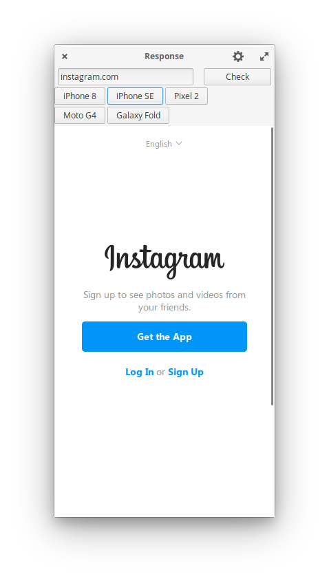

# Response

Test your web page's Responsiveness in Linux Desktop ! <br>

And build Mobile first Websites with less resource hog :)



<!-- ## Get it from the elementary OS AppCenter!

[](https://appcenter.elementary.io/Response) -->

⏰️ Soon this app will be available on the elementary OS AppCenter.

# 👨‍💻️ Install it from source

You can of course download and install this app from source.

## Dependencies

Ensure you have these dependencies installed

* granite
* gtk+-3.0
* switchboard-2.0
* webkit2gtk-4.0

## Install, build and run

```bash
# install elementary-sdk, meson and ninja
sudo apt install elementary-sdk meson ninja
# clone repository
git clone https://github.com/RajSolai/Response 
# cd to dir
cd Response
# run meson
meson build --prefix=/usr
# cd to build, build and test
cd build
sudo ninja install && com.github.rajsolai.response
```

