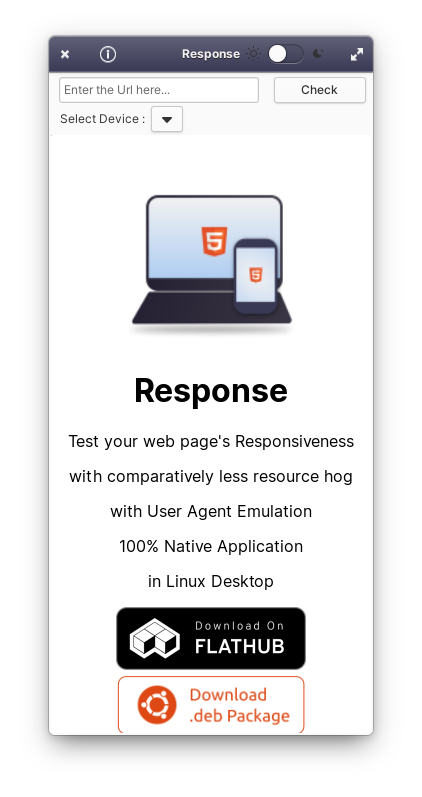

# Response

Test your web page's Responsiveness in Linux Desktop ! <br>

And build Mobile first Websites with less resource hog :)

<a href="https://www.producthunt.com/posts/response-2?utm_source=badge-review&utm_medium=badge&utm_souce=badge-response-2#discussion-body" target="_blank"></a>

[](https://appcenter.elementary.io/com.github.rajsolai.response)

<a href='https://flathub.org/apps/details/com.github.rajsolai.response'></a>



## Support Me

<a href="https://www.buymeacoffee.com/rajsolai" target="_blank"></a>

## Dependencies

Ensure you have these dependencies installed

-   granite
-   gtk+-3.0
-   switchboard-2.0
-   webkit2gtk-4.0

## Install, build and run

```bash
# install elementary-sdk, meson and ninja
sudo apt install elementary-sdk meson ninja
# clone repository
git clone https://github.com/RajSolai/Response
# cd to dir
cd Response
# run meson
meson build --prefix=/usr
# cd to build, build and test
cd build
sudo ninja install && com.github.rajsolai.response
```
